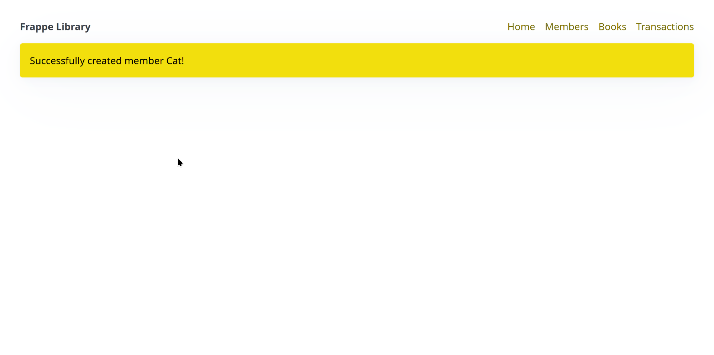
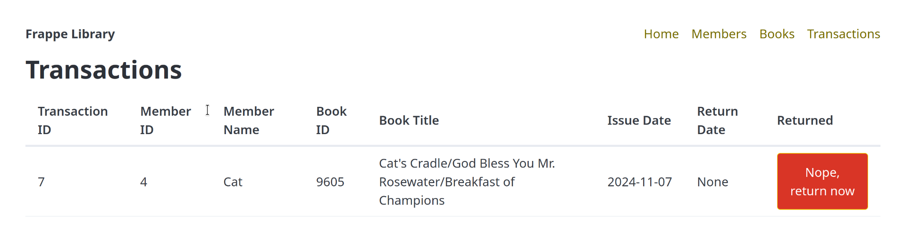
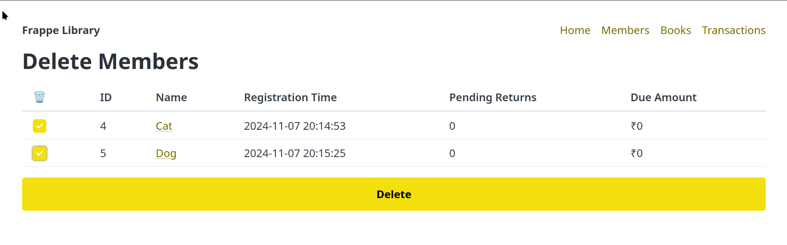

# Frappe-Library

My implementation of Frappe's dev-hiring-test.

# Functionality

- Allows you to create members using members' names and stores them alongwith the timestamp of creation.
- Books can be inserted manually or through the Frappe API using the fields: title, isbn, authors and publisher
- The amount of stock imported can be specified.
- Both books and members can be batch deleted.
- Books can be issued to members at Rs.100 per book.
- Members can't issue books after their due amount is Rs.500.
- All these transactions are stored in a transactions table.
- The librarian can return a book from there.

**Note**: I couldn't figure out what to do with the foreign key constraint on transactions, so if a transaction's corresponding member and/or book is deleted, the transaction also get deleted using the `on delete cascade` policy.

# Usage

1. Install the dependencies.
   `python -r requirements.txt`
2. Setup the database file.
   `python setup.py`
3. Run using Flask's development server.
   `flask run`

**Note**: This also runs with Gunicorn.

# Screenshots

# Checklist

- [x] Create DB schema
- [x] Add DB connection object. (**Note**: Foreign keys have to be turned on manually)
- [x] Create screens for:
  - [x] Members (with CRUD)
    - [x] Create
    - [x] Read
    - [x] Update
    - [x] Delete
  - [x] Books (CRUD + import using API (separate screen))
  - [x] Transactions (view-only)
- [x] Interface with the Frappe book API.
- [x] Screen for book insert (maybe htmx if needed)
- [x] Return logic
- [x] Clean the code
